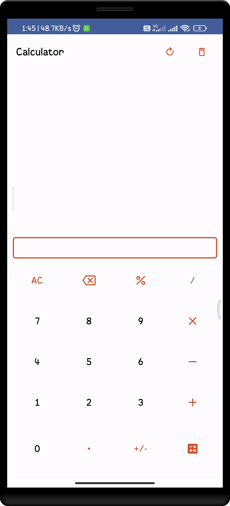
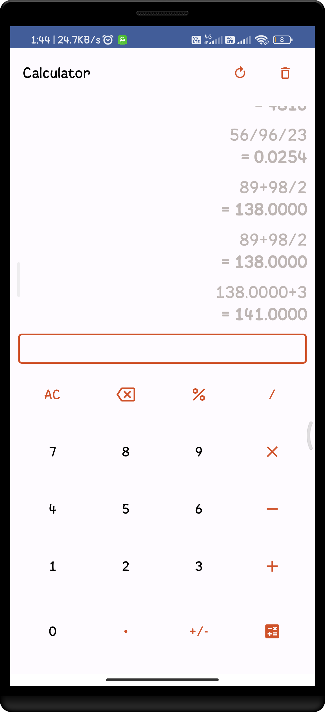
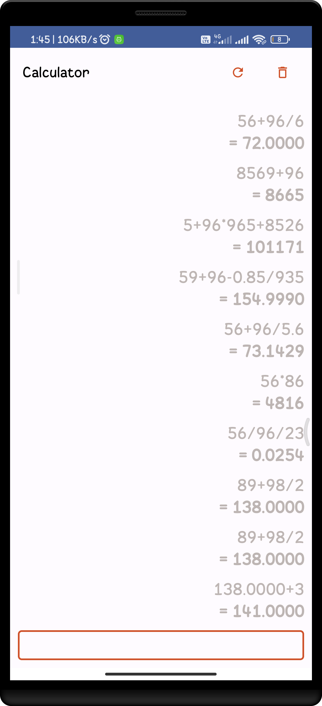

<br />
<div align="center">
  <a href="https://github.com/sparjapati/Calculator-App">
    
  </a>

  <h3 align="center">Simple Calculator App</h3>

  <p align="center">
    Basic device calculator for arithmetic operations with a limited range of functions.
    <br />
    <br />
    <a href="https://github.com/sparjapati/Calculator-App/releases/tag/v1.0">View Demo</a>
    ·
    <a href="https://github.com/sparjapati/Calculator-App/issues">Report Bug</a>
    ·
    <a href="https://github.com/sparjapati/Calculator-App/issues">Request Feature</a>
  </p>
</div>

<details>
  <summary>Table of Contents</summary>
  <ol>
    <li>
      <a href="#about-the-project">About The Project</a>
    </li>
    <li>
      <a href="#getting-started">Getting Started</a>
      <ul>
        <li><a href="#prerequisites">Prerequisites</a></li>
        <li><a href="#installation">Installation</a></li>
      </ul>
    </li>
    <li><a href="#usage">Usage</a></li>
    <li><a href="#contributing">Contributing</a></li>
    <li><a href="#license">License</a></li>
    <li><a href="#contact">Contact</a></li>
  </ol>
</details>


<!-- ABOUT THE PROJECT -->
## About The Project

<p float="left">
  
   
  
</p>

A simple calculator is a basic electronic device that is designed to perform simple arithmetic calculations. It typically consists of a keypad with numeric keys and various function keys for mathematical operations such as addition, subtraction, multiplication, and division. Additionally, it may have keys for functions such as square root, percentage, and exponentiation.

The device has a small screen or display that displays the results of the calculations. Simple calculators are widely available in various designs and models, and they are generally affordable and easy to use. They are portable and often battery-powered, making them convenient for use on-the-go.

Simple calculators are commonly used for everyday calculations in homes, offices, and schools. For example, they may be used for balancing a checkbook, calculating the tip at a restaurant, or performing simple math problems in a math class. They are also used in various industries for basic calculations, such as in finance and accounting.

Despite their basic functions, some simple calculators can also perform more advanced operations, such as trigonometric functions, logarithmic functions, and statistical functions. However, these features are typically found on more advanced models.

Overall, simple calculators are essential tools for performing basic arithmetic calculations, and they are widely used in various settings.

<p align="right">(<a href="#readme-top">back to top</a>)</p>


### Built With

* [Kotlin]("https://kotlinlang.org/")
* [Jetpack Compose]("https://developer.android.com/jetpack/compose")
* [Kotlin](https://kotlinlang.org/) - First class and official programming language for Android development.
* [Coroutines](https://kotlinlang.org/docs/reference/coroutines-overview.html) - For asynchronous and more..
* [Flow](https://kotlin.github.io/kotlinx.coroutines/kotlinx-coroutines-core/kotlinx.coroutines.flow/-flow/) - A cold asynchronous data stream that sequentially emits values and completes normally or with an exception.
* [Room](https://developer.android.com/training/data-storage/room) - The Room library in Android is a persistence library that provides an abstraction layer over SQLite to allow for easier database access and management in Android applications.
* [Dependency Injection](https://developer.android.com/training/dependency-injection) - 
    * [Hilt-Dagger](https://dagger.dev/hilt/) - Standard library to incorporate Dagger dependency injection into an Android application.
    * [Hilt-ViewModel](https://developer.android.com/training/dependency-injection/hilt-jetpack) - DI for injecting `ViewModel`.
* [Material Components for Android](https://github.com/material-components/material-components-android) - Modular and customizable Material Design UI components for Android.

<p align="right">(<a href="#readme-top">back to top</a>)</p>


<!-- GETTING STARTED -->
## Getting Started

This is an example of how you may give instructions on setting up your project locally.
To get a local copy up and running follow these simple example steps.

### Prerequisites

You need to use the software and how to install them.
* Android-Studio - <a>https://developer.android.com/studio</a>
  
### Installation

_Below is an example of how you can instruct your audience on installing and setting up your app. This template doesn't rely on any external dependencies or services._


1. Clone the repo
   ``` sh
   git clone https://github.com/sparjapati/Calculator-App.git
   ```
2. Open project in android studio.
3. Build project and run on an emulator or physical device.

<p align="right">(<a href="#readme-top">back to top</a>)</p>


<!-- CONTRIBUTING -->
## Contributing

If you want to contribute to this library, you're always welcome!
See [Contributing Guidelines](CONTRIBUTING.md). 

If you have a suggestion that would make this better, please fork the repo and create a pull request. You can also simply open an issue with the tag "enhancement".
Don't forget to give the project a star! Thanks again!

1. Fork the Project
2. Create your Feature Branch (`git checkout -b feature/AmazingFeature`)
3. Commit your Changes (`git commit -m 'Add some AmazingFeature'`)
4. Push to the Branch (`git push origin feature/AmazingFeature`)
5. Open a Pull Request

<p align="right">(<a href="#readme-top">back to top</a>)</p>


<!-- LICENSE -->
## License
```
MIT License
Copyright (c) 2020
Permission is hereby granted, free of charge, to any person obtaining a copy
of this software and associated documentation files (the "Software"), to deal
in the Software without restriction, including without limitation the rights
to use, copy, modify, merge, publish, distribute, sublicense, and/or sell
copies of the Software, and to permit persons to whom the Software is
furnished to do so, subject to the following conditions:
The above copyright notice and this permission notice shall be included in all
copies or substantial portions of the Software.
THE SOFTWARE IS PROVIDED "AS IS", WITHOUT WARRANTY OF ANY KIND, EXPRESS OR
IMPLIED, INCLUDING BUT NOT LIMITED TO THE WARRANTIES OF MERCHANTABILITY,
FITNESS FOR A PARTICULAR PURPOSE AND NONINFRINGEMENT. IN NO EVENT SHALL THE
AUTHORS OR COPYRIGHT HOLDERS BE LIABLE FOR ANY CLAIM, DAMAGES OR OTHER
LIABILITY, WHETHER IN AN ACTION OF CONTRACT, TORT OR OTHERWISE, ARISING FROM,
OUT OF OR IN CONNECTION WITH THE SOFTWARE OR THE USE OR OTHER DEALINGS IN THE
SOFTWARE.
```

<p align="right">(<a href="#readme-top">back to top</a>)</p>


<!-- CONTACT -->
## Contact

Your Name - [@_sparjapati_](https://twitter.com/_sparjapati_)

Project Link: [https://github.com/sparjapati/Calculator-App](https://github.com/sparjapati/Calculator-App)

<p align="right">(<a href="#readme-top">back to top</a>)</p>
